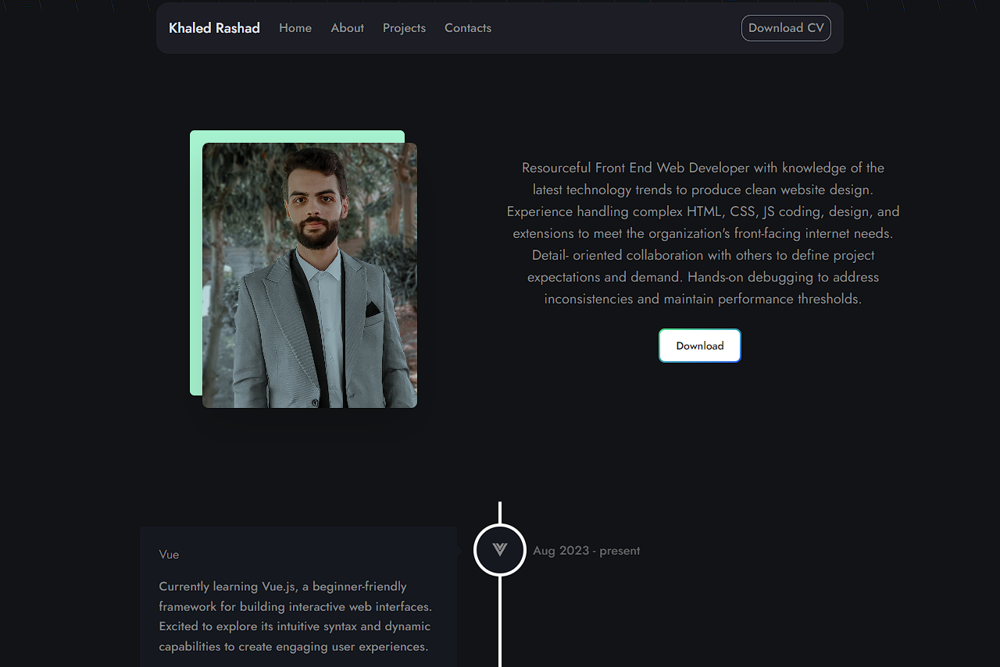

&nbsp;&nbsp;&nbsp;&nbsp;&nbsp;&nbsp;

  <h1 align="center">Khaled Rashad's Portfolio</h1>

<a href="https://portfolio-khaled-jinx.vercel.app/">

</a>

## Introduction

Personal Portfolio.

## Main Technologies used

  

## Support

If you like my work, feel free to:

- ⭐ this repository. It helps.

### Create a bug report

If you see an error message or run into an issue, please [create bug report](https://github.com/khaleddrashadd/portfolio/issues). This effort is valued.
